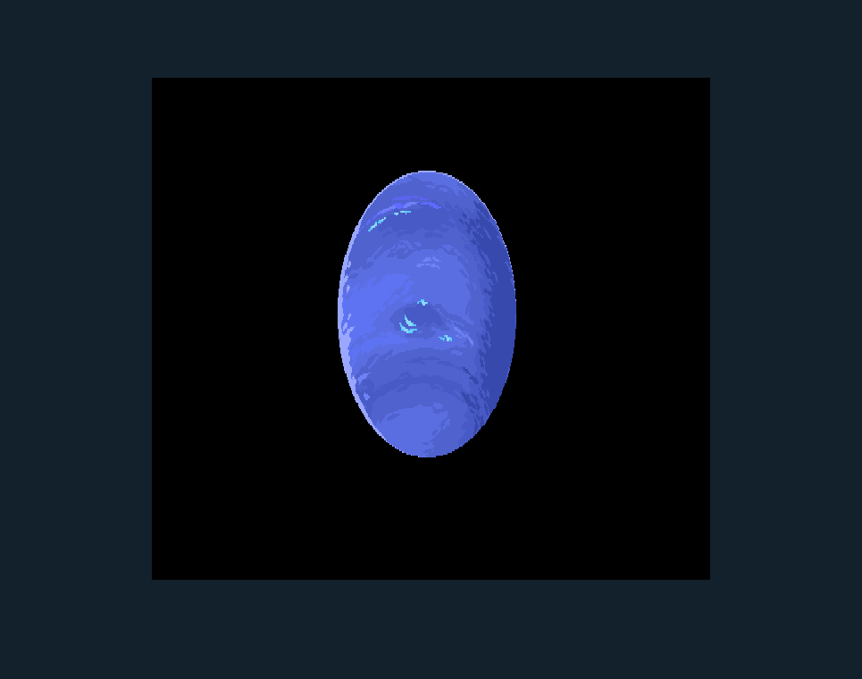

//_______________________________
//Project : LEX_LIB
//Version : 0.0.0.1 Alpha
//Core : OpenGL 4.6
//------------------------------
// The engine was created by LimboMC and is based on the learn OpenGL project by VictorGordan.
// Original tutorials available at:
// https://github.com/VictorGordan/opengl-tutorials
// Lex_Engine is a graphics library created for learning purposes using OpenGL 4.6.
//______________________________
This project is for learning purposes, created from OpenGL exercises found on YouTube.
//______________________________

```cpp
#include<stb_image.h>
#include"lex.h"
// Vertices coordinates
GLfloat vertices[] =
{ //     COORDINATES     /        COLORS      /   TexCoord  //
	-0.5f, -0.5f, 0.0f,     1.0f, 0.0f, 0.0f,	0.0f, 0.0f, // Lower left corner
	-0.5f,  0.5f, 0.0f,     0.0f, 1.0f, 0.0f,	0.0f, 1.0f, // Upper left corner
	 0.5f,  0.5f, 0.0f,     0.0f, 0.0f, 1.0f,	1.0f, 1.0f, // Upper right corner
	 0.5f, -0.5f, 0.0f,     1.0f, 1.0f, 1.0f,	1.0f, 0.0f  // Lower right corner
};
// Indices for vertices order
GLuint indices[] =
{
	0, 2, 1, // Upper triangle
	0, 3, 2 // Lower triangle
};
//Fish
int main()
{
	// Initialize GLFW
	LexInit();
	LWindow Window;
	Window.LCreateWindow(1000, 900, "Hello");
	Window.LSetContextWindow();
	// Error check if the window fails to create
	glViewport(0, 0, 1000, 900);
	// Generates Shader object using shaders defualt.vert and default.frag
	LShader shaderProgram("default.vertex", "default.fragment");
	glProgramParameteri(shaderProgram.Program, GL_PROGRAM_SEPARABLE, GL_TRUE);
	// Generates Vertex Array Object and binds it
	LVAO VAO1;
	VAO1.Bind();
	LVBO VBO1(vertices, sizeof(vertices));
	LEBO EBO1(indices, sizeof(indices));
	VAO1.LinkAttrib(VBO1, 0, 3, GL_FLOAT, 8 * sizeof(float), (void*)0);
	VAO1.LinkAttrib(VBO1, 1, 3, GL_FLOAT, 8 * sizeof(float), (void*)(3 * sizeof(float)));
	VAO1.LinkAttrib(VBO1, 2, 2, GL_FLOAT, 8 * sizeof(float), (void*)(6 * sizeof(float)));
	VAO1.Unbind();
	VBO1.Unbind();
	EBO1.Unbind();
	// Gets ID of uniform called "scale"
	GLuint uniID = glGetUniformLocation(shaderProgram.Program, "Scale1");
	LTexture Texture;
	Texture.LSetFlipImage(true);
	Texture.LLoadTexture("Planet.png");
	Texture.LActiveTexture(GL_TEXTURE0);
	Texture.LBindTexture2D();
	Texture.LSetTexture2D(GL_NEAREST, GL_NEAREST, GL_REPEAT, GL_REPEAT);
	Texture.LTexImage2D(LEX_TEXTURE_2D,0,GL_RGBA,GL_UNSIGNED_BYTE);
	Texture.LFreeTexture();
	Texture.LUnBind2D();
	GLuint Tex0Uni = glGetUniformLocation(shaderProgram.Program, "tex0");
	shaderProgram.Activate();
	glUniform1i(Tex0Uni, 0);
	while (!Window.LShouldClose())
	{
		LSetColor(0.07f, 0.13f, 0.17f, 1.0f);
		shaderProgram.Activate();
		glUniform1f(uniID, 0.5f);
		Texture.LBindTexture2D();
		// Bind the VAO so OpenGL knows to use it
		VAO1.Bind();
		LDrawElements(GL_TRIANGLES, 9, GL_UNSIGNED_INT, 0);
		// Swap the back buffer with the front buffer
		Window.LPollWindow();
	}
	// Delete all the objects we've created
	VAO1.Delete();
	VBO1.Delete();
	EBO1.Delete();
	Texture.LDeleteTexture();
	shaderProgram.DeleteProgram();
	// Delete window before ending the program
	Window.LDestroyWindow();
	return 0;
}
```
